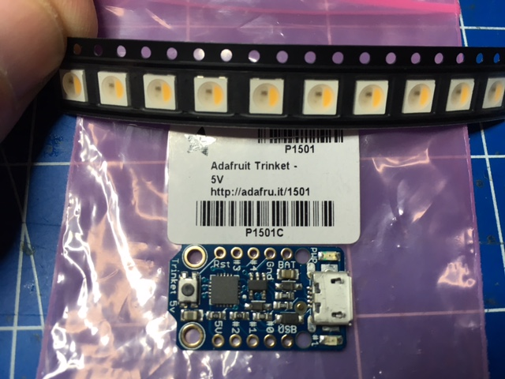
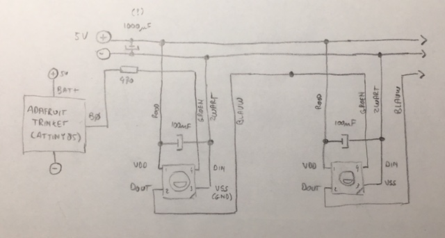
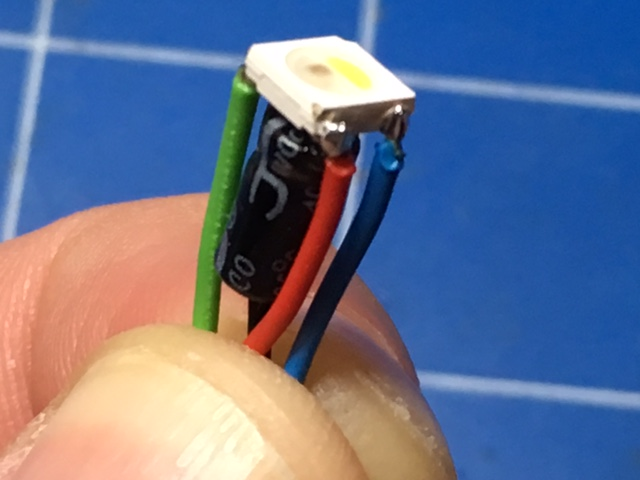
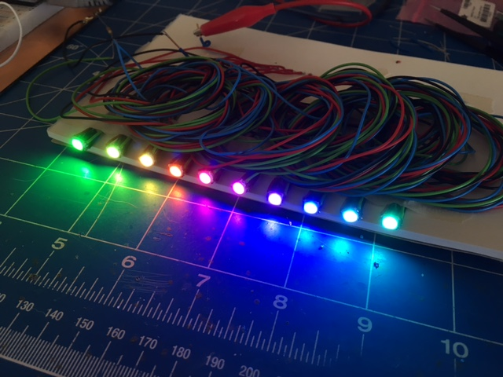
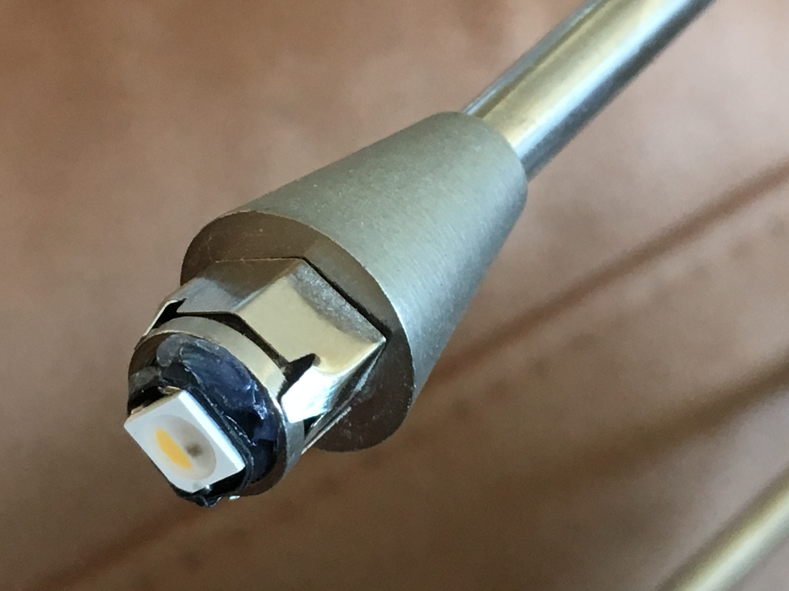
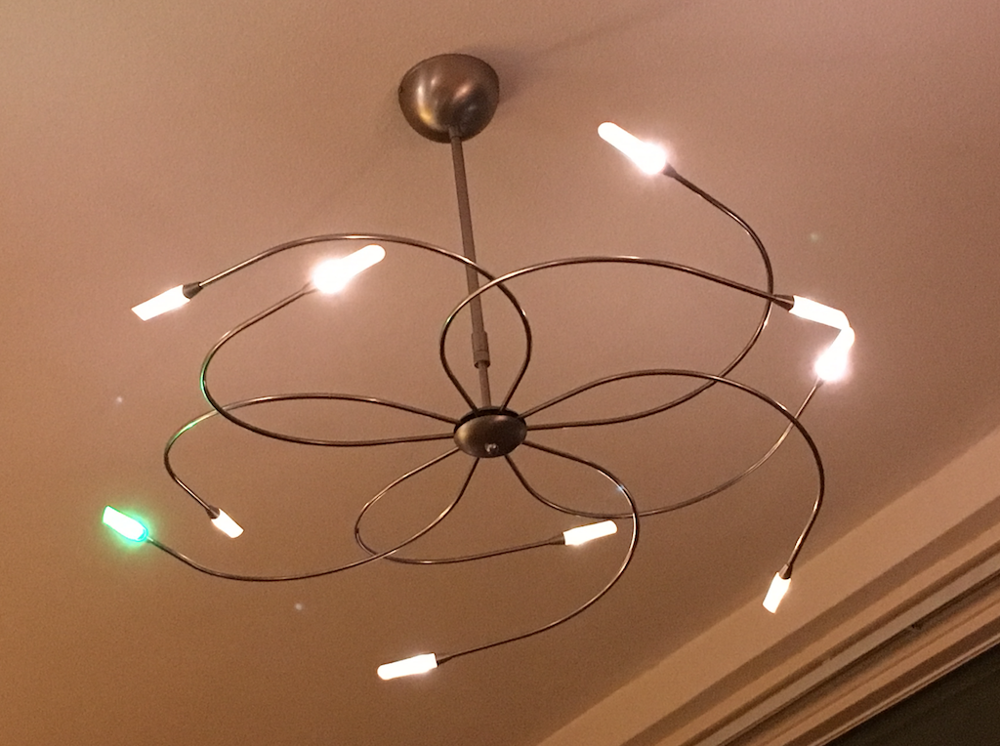

NeoLamp
=======

Fun project to replace the halogen bulbs of a design lamp with NeoPixels. Here's a short
howto. Scroll through, you'll get the picture.

A halogen lamp broke. So I ordered some NeoPixels and a Trinket:

Based on the specs and the demo code coming with the NeoPixel libraries (also in available
in this repo, for backup) a simple schema of a strand of neopixels looks like this:

Wiring up the pixels with a 100nF capacitor so it will fit the halogen lamp socket (look
further down to see how it looks mounted).

Wiring 10 of these up and creating a rainbow test (code is part of the sources).

Next up, remove the halogen sockets and replace everyone with a NeoPixel, like this:

Then, carefully number all the pixels to see where they end up in the center, so we
wire them up in the correct order. Masking tape is ideal for these things:

Powering 10 NeoPixels uses at most 0,5 Amps at 5 Volts, so we can easily power it with a
1,5 Amps 5 Volt adapter that fits in the housing of where the old halogen transformer
once was. Make sure you check that the adapter doesn't get too warm, there is no
ventilation in there!

When all is done, and you put the lamp back up, it looks kind of like this:

The current program shows a rainbow when turning the lamp on, and then turns to warm white
at reduced brightness. Once in a while it will slowly make one of the NeoPixels a random
color of the rainbow.

I'm sure you'll find more/better/nicer/funnier colors and animations. Have fun!